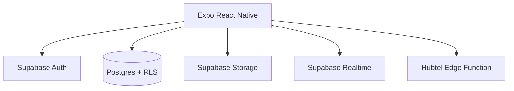

# UMaT Hostels

**UMaT student hostel platform** — Expo/React Native app for discovering, comparing, booking, and paying for hostels near Tarkwa, with messaging between students and hostel owners.

---

## Table of Contents

- [System Design](#system-design)
- [Features](#features)
- [Technology Stack](#technology-stack)
- [Getting Started](#getting-started)
- [Configuration](#configuration)
- [Deployment](#deployment)
- [Project Structure](#project-structure)
- [License](#license)

---

## System Design

A **mobile Expo app** talks to **Supabase** for auth, Postgres data, storage, and realtime messaging. Payments flow through a **Hubtel** checkout Edge Function supporting MTN MoMo, Vodafone Cash, and AirtelTigo.



| Layer | Role |
|-------|------|
| **Screens** | Search, booking, payment, reviews, messaging, profile |
| **hooks/** | TanStack Query data fetching (hostels, payments, messages) |
| **services/** | Supabase client, payment checkout |
| **supabase_schema.sql** | Profiles, hostels, bookings, reviews, conversations, payments |

---

## Features

- Auth: register, login, email verification
- Hostel search, filters, map view, favorites
- Booking flow with payment history
- Reviews and ratings
- Messaging threads (student ↔ hostel owner)
- Premium upgrade screen (freemium model)
- Onboarding flow and profile management

---

## Technology Stack

| Component | Technology |
|-----------|------------|
| Mobile | Expo SDK 54, React Native 0.81, TypeScript |
| Navigation | React Navigation (stack + tabs) |
| Data fetching | TanStack Query |
| Backend | Supabase (Auth, Postgres, Storage, Realtime) |
| Payments | Hubtel via Supabase Edge Function |
| Local cache | AsyncStorage |

---

## Getting Started

### Prerequisites

- Node.js 18+
- Expo CLI
- Supabase project (run `supabase_schema.sql`)

### Install and run

```bash
npm install
cp .env.example .env    # fill Supabase keys

npx expo start
npm run android         # Native Android
npm run ios             # Native iOS
npm run start:tunnel    # Tunnel mode for device testing
```

---

## Configuration

| Variable | Purpose |
|----------|---------|
| `EXPO_PUBLIC_SUPABASE_URL` | Supabase project URL |
| `EXPO_PUBLIC_SUPABASE_ANON_KEY` | Supabase anon key |
| `EXPO_PUBLIC_PAYMENTS_URL` | Hubtel checkout Edge Function URL |
| `EXPO_PUBLIC_APP_ENV` | e.g. `development` |
| `EXPO_PUBLIC_API_BASE_URL` | Supabase REST base URL |
| `EXPO_PUBLIC_EMAIL_REDIRECT_URL` | Optional deep link for email verify |

> Do not commit real API keys. Use `.env` locally and EAS secrets for production.

---

## Deployment

| Component | Target |
|-----------|--------|
| **Backend** | Supabase (schema + Edge Functions for payments) |
| **Mobile** | Expo EAS Build → App Store / Play Store |

```bash
npx eas build --platform all
```

---

## Project Structure

```
UMaTHostels/
├── App.tsx
├── app.json
├── src/
│   ├── navigation/
│   ├── screens/
│   ├── services/
│   ├── hooks/
│   ├── context/
│   └── components/
├── supabase_schema.sql
└── .env.example
```

---

## License

See repository for license terms.
